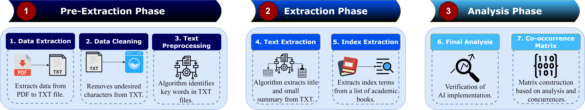

<style>
img{
  border-radius: 10px;
}
.col-md-3 {
  margin-top:10px;
  margin-bottom:10px;
  padding:0px;
  display:block;
  overflow:hidden;
  text-align:center;
  display: table-cell;
  background: white;
  border-radius: 20px;
  height: auto;
}
iframe {
  margin:0;
  padding:0;
  width: 175px;
  display: inline;
  vertical-align: middle;
}
</style>

# Research

## Project 1


<div class="jumbotron">
<div class="col-md-12 col-sm-12">
<h4>[Enabling Artificial Intelligence into Cybersecurity Education: A Comprehensive Data-driven Approach](https://github.com/cslfiu/NSF_EAGER_SaTC_Project)</h4>

This repository contains the data and code used in our paper, "Enabling Artificial Intelligence into Cybersecurity Education: A Comprehensive Data-driven Approach".

Cybersecurity researchers and practitioners have determined that modern cybersecurity methods are increasingly using AI techniques. However, the cybersecurity curriculum has not been updated to integrate such topics or techniques. Therefore, we find it imperative to find relevant topics in AI that are most commonly used within cybersecurity in order to form an explicit AI module that integrates AI concepts into cybersecurity.

We ask the questions: What are the most common correlations between AI and cybersecurity topics? What are suitable AI topics to integrate in a module within the context of cybersecurity?

To that end, we follow a methodology that considers over 5000 research papers from top-tier cybersecurity conferences and journals (e.g., NDSS, USENIX, ACM CCS, IEEE S\&P, and IEEE TIFS). We extracted AI-related keywords and used Natural Language Processing (NLP) techniques to identify AI concepts. Furthermore, we extracted cybersecurity keywords from a cybersecurity pilot course, incorporating additional keywords from cybersecurity academic textbooks. We used the extracted keywords to create a co-occurrence matrix. Finally, we created a specific AI module using the co-occurrence matrix for a cybersecurity course within an academic institution.


</div>
</div>




## Project 2

<div class="jumbotron">
<div class="col-md-12 col-sm-12">
<h4>[Data Collection](https://github.com/cslfiu/NSF_Eager_SaTC_Project_2)</h4>

For our data collection, we distributed two surveys within a lecture titled "A Lecture on Artificial Intelligence, Machine Learning, and Deep Learning: From Theory to Practice". We collected data using the Qualtrics platform and distributed the surveys via anonymous links or anonymous QR codes. The first survey contains questions about demographics, cybersecurity, AI models, and their corresponding performance metrics. The second survey contains questions regarding demographics, AI metrics, AI models, Deep Learning, and AI training.
</div>
</div>


<div class="jumbotron">
<div class="col-md-12 col-sm-12">
<h4>[Pre-processing and Analysis](https://github.com/cslfiu/NSF_Eager_SaTC_Project_2)</h4>

## Setup Instructions

**1. Install all packages and download any commented sections.**
```bash
#import packages
import nltk
import spacy
import pandas as pd
#etc...


#uncomment and download
nltk.download()
spacy.cli.download("en_core_web_lg")
```

**2. Run all jupyter notebooks to completion.**
```bash
1. lecture_text_extractor.ipynb
2. survey_topics.ipynb
3. Survey_Grading.ipynb
4. Feedback_Analysis.ipynb
```

## Reproducibility Instructions
Our code does not consider certain data and uses specific file names. To accurately reproduce this study, consider:

1. [Lecture Extraction](https://github.com/cslfiu/NSF_Eager_SaTC_Project_2/blob/main/lecture_text_extractor.ipynb): This code extracts all the text in a PDF file using PyPDF2. Convert our lecture (or your own AI module) into a PDF and rename the file to Final_AI_ML_Lecture.pdf.

2. [Topic Extraction](https://github.com/cslfiu/NSF_Eager_SaTC_Project_2/blob/main/survey_topics.ipynb): This code extracts topics and displays them as a topic distribution. Rename all survey CSV files to match the ones used in the code.

3. [Survey Analysis](https://github.com/cslfiu/NSF_Eager_SaTC_Project_2/blob/main/Survey_Grading.ipynb): This code analyzes and scores the student performance before and after the lecture. Rename all survey CSV files as necessary (including the CSV with correct answers). Remove any extra columns provided by Qualtrics, stopping at the column with participant IDs. Remove any rows that contain unnecessary data provided by Qualtrics, stopping at the question number row. Make sure to download the extracted lecture text file.

4. [Feedback Analysis](https://github.com/cslfiu/NSF_Eager_SaTC_Project_2/blob/main/Feedback_Analysis.ipynb): This code assess feedback analysis using sentimentality models. Make sure to remove any unnecessary data provided by Qualtrics as done in the previous step. Rename any CSV files as necessary.

</div>
</div>
